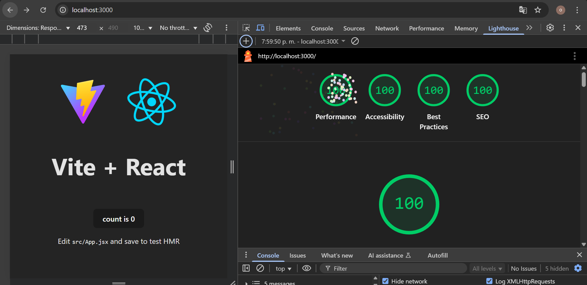

## Antes - Pruebas lighthouse - Proyecto base generado por React

## Ahora - Optimización lighthouse Todo en verde

## Ahora - Optimización lighthouse
Sin embargo para que todo esté en 100% se debe contar con la configuracion robots.txt que la puedes encontrar en la root de este proyecto.  

